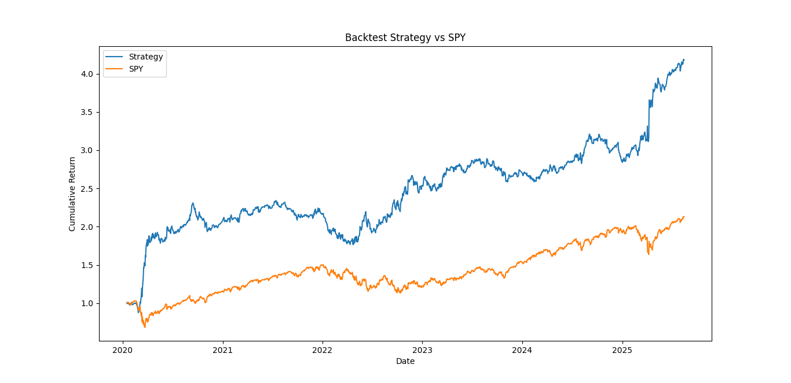

# Quantitative Backtesting Strategy with Machine Learning (SPY)

Python project for building and backtesting a simple long/short trading strategy on SPY using supervised machine learning models.

## Objective
To test whether predictive models can generate profitable trading signals on daily returns, validated with time-series cross-validation and evaluated in a realistic backtest.

## What the script does
- Downloads SPY price data from 2020 to today (using `yfinance`)
- Engineers features (momentum, volatility and volume-based indicators)
- Trains three ML models: Linear Regression, Random Forest, XGBoost
- Automatically selects the best model based on cross-validated MSE
- Translates predictions into long/short trading signals
- Backtests performance and compares it to buy-and-hold SPY
- Calculates Sharpe Ratio, Max Drawdown and Cumulative Returns

## Example Output
Performance of the ML-based long/short strategy compared to a passive SPY buy and hold:

## Technologies
- Python (pandas, numpy, scikit-learn, xgboost, matplotlib, yfinance)
- TimeSeriesSplit cross-validation
- Rolling performance metrics

## What I learned
- How to engineer predictive features using financial time series
- Importance of time-series validation in ML trading
- How to backtest strategies and evaluate Sharpe ratio and drawdowns

---

Created by Alice Proietti
